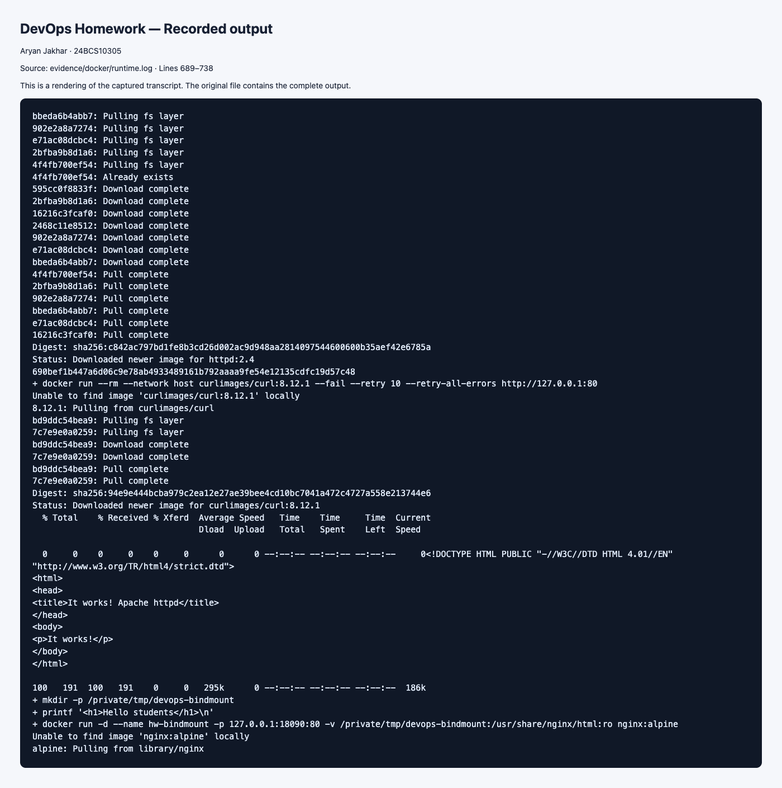
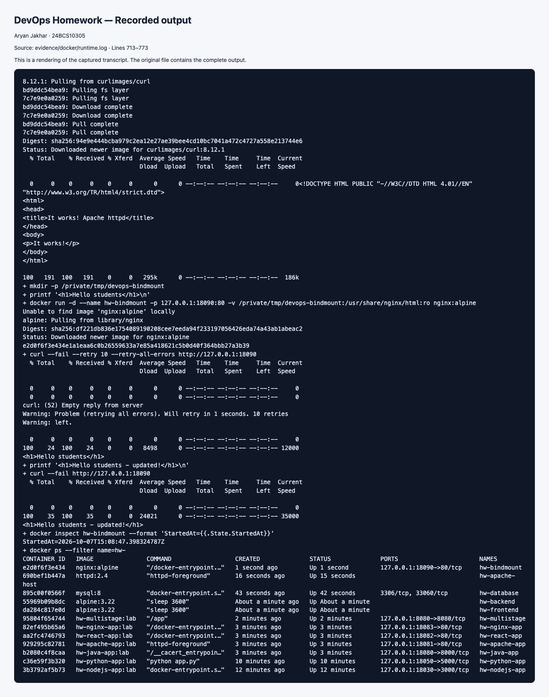

# Docker Networking & Volumes

**Executed on 2026-10-07 using the Ubuntu Colima Docker host.**
The [recorded transcript](../evidence/docker/runtime.log) verifies three networks,
a backend attached to two networks, expected isolation and successful
connectivity after attachment, Apache on the Linux host's port 80, and bind
mount changes without a restart. The lab uses `hw-` name prefixes and host port
18090 for the bind-mount demo to avoid other applications.

## Task 1: Container Networking (3 containers, 3 networks)

```bash
# create 3 separate networks
docker network create net1
docker network create net2
docker network create net3

# frontend + backend: nginx/alpine, database: mysql
docker run -d --name frontend --network net1 nginx:alpine
docker run -d --name backend  --network net1 nginx:alpine
docker run -d --name database --network net3 \
  -e MYSQL_ROOT_PASSWORD=example mysql:8

# put backend on a second network too
docker network connect net2 backend

# check networks
docker network inspect net1 | grep -A2 '"Name"'
docker inspect backend --format '{{json .NetworkSettings.Networks}}'

# connectivity checks
docker exec frontend ping -c 2 backend      # works: both on net1
docker exec frontend ping -c 2 database     # fails: no shared network
docker network connect net3 frontend        # add frontend to net3 to test database reachability
docker exec frontend ping -c 2 database     # now works
```

**Expected result:** `frontend` and `backend` can reach each other over
`net1`; `backend` can communicate on both `net1` and `net2`, but does not
automatically forward traffic between them. Two containers in this setup
can reach each other directly when they share a network — Docker's default bridge
networking isolates containers on different user-defined networks.

## Task 2: Host Network (Apache2)

```bash
docker pull httpd:2.4

docker run -d --name apache-host --network host httpd:2.4

curl http://localhost:80
# <html><body><h1>It works!</h1></body></html>
```

With `--network host`, the container shares the host's network namespace
directly — no `-p`/port-mapping is needed or even possible, since the
container isn't isolated onto its own IP; it binds straight to the host's
port 80.

## Task 3: Bind Mount

`bind-mount-demo/index.html` in this folder contains `Hello students`.

```bash
# bind mount the local folder into an nginx container
docker run -d --name bindmount-demo -p 8090:80 \
  -v "$(pwd)/bind-mount-demo:/usr/share/nginx/html:ro" \
  nginx:alpine

curl http://localhost:8090
# <h1>Hello students</h1>

# edit the file on the HOST (not inside the container)
echo '<h1>Hello students - updated!</h1>' > bind-mount-demo/index.html

curl http://localhost:8090
# <h1>Hello students - updated!</h1>
# reflected immediately, no container restart needed
```

A bind mount points a container path directly at a real path on the host
filesystem, so any change made on either side (host or container) is visible
to the other immediately — unlike a copied file baked into an image layer.

## Task 4: Overlay Network — Research Notes

An **overlay network** is a virtual network that spans **multiple Docker
hosts**, letting containers on different physical/VM machines communicate as
if they were on the same LAN. Docker implements it using VXLAN encapsulation
to tunnel container traffic between hosts over the existing physical network.

**Key points:**

- Requires **Swarm mode** (`docker swarm init`) to coordinate network state
  across hosts — a plain single-host
  `docker network create` only gives you `bridge`/`host`/`none`, not overlay.
- Used for multi-host container communication — e.g. a `web` service on
  Host A talking to a `db` service on Host B by service name, exactly like
  they would if colocated.
- Each container gets an IP on the overlay's private subnet; Docker's
  embedded DNS resolves service/container names to those IPs across hosts.
- Typical use case: a Swarm cluster or multi-node deployment where services
  need to discover and reach each other without manually managing IPs or
  opening host-level ports between every pair of machines.
- Contrast with `bridge` (single host only) and `host` (shares the host's
  network stack, no isolation) — overlay is the only built-in driver that
  is inherently multi-host.

```bash
# example: creating an overlay network in Swarm mode
docker swarm init
docker network create -d overlay my-overlay-net
docker service create --name web --network my-overlay-net -p 8080:80 nginx:alpine
```

## Captured evidence

The command-output screenshots render excerpts of the actual transcript.
The two bind-mount screenshots were captured directly from the running website.
[Before/after output](../evidence/docker/bindmount.log) shows the same container
start timestamp, proving it was not restarted between edits.





