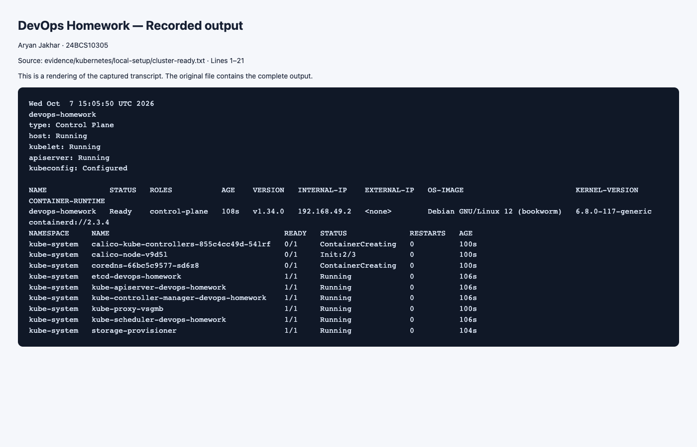
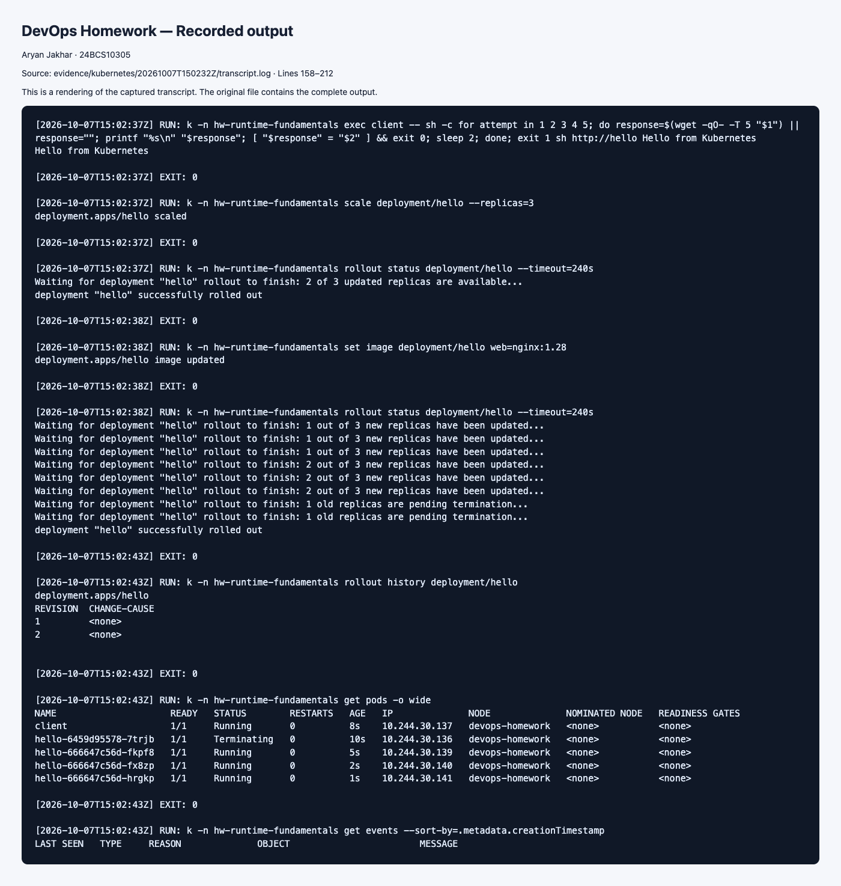

# Kubernetes Fundamentals

> Executed on 7 October 2026 using Kubernetes v1.34.0 and Minikube. The [runtime evidence index](../evidence/kubernetes/README.md) distinguishes the hosted run, its six runner-check failures, and targeted local repairs. Commands below remain a reproducible guide; the recorded-results section links observed output.

## Task 1: Install and verify Minikube

Install Docker Desktop (start its engine), kubectl and Minikube using their official platform installers. On macOS with Homebrew:

```bash
brew install kubectl minikube
minikube start --driver=docker --cpus=2 --memory=4096
minikube status
kubectl config current-context
kubectl cluster-info
kubectl get nodes -o wide
kubectl get pods -n kube-system
```

Expected: the `minikube` context, a Ready node, and healthy control-plane/DNS Pods. A stopped Docker engine prevents this driver from starting. Record actual versions with `kubectl version --client` and `minikube version`.

## Task 2: Architecture and objects

The API server is the cluster entry point. etcd persists cluster state. The scheduler assigns unscheduled Pods to nodes. Controllers reconcile desired state (for example replacing missing replicas). Each worker runs kubelet, a container runtime and networking components. kubelet starts containers and reports their health; the CNI implements Pod networking, while kube-proxy or a replacement implements Service forwarding.

A Pod is the scheduling unit; a ReplicaSet maintains a replica count; a Deployment manages ReplicaSets and rollouts; a Service provides discovery and a stable access point. Namespaces group namespaced resources. ConfigMaps and Secrets supply configuration; PVCs request persistent storage.

## Task 3: Basics tutorial — deploy, explore, expose, scale, update

Run from this folder. The Service in the manifest exposes port 80 inside the cluster.

```bash
kubectl create namespace hw-fundamentals
kubectl apply -n hw-fundamentals -f deployment.yaml
kubectl rollout status -n hw-fundamentals deployment/hello
kubectl get -n hw-fundamentals deployments,replicasets,pods,services
kubectl describe -n hw-fundamentals deployment hello
kubectl logs -n hw-fundamentals deployment/hello
kubectl exec -n hw-fundamentals deployment/hello -- cat /usr/share/nginx/html/index.html
kubectl scale -n hw-fundamentals deployment/hello --replicas=3
kubectl get -n hw-fundamentals pods -o wide
kubectl set image -n hw-fundamentals deployment/hello web=nginx:1.28
kubectl rollout status -n hw-fundamentals deployment/hello
kubectl rollout history -n hw-fundamentals deployment/hello
kubectl port-forward -n hw-fundamentals service/hello 8080:80
# Second terminal:
curl http://127.0.0.1:8080
```

Expected: three ready replicas after scaling, a new ReplicaSet after changing the image, and `Hello from Kubernetes` from curl. Save command output and a browser screenshot. Stop port-forward with Ctrl+C, then `kubectl delete namespace hw-fundamentals`.

References: [Kubernetes basics](https://kubernetes.io/docs/tutorials/kubernetes-basics/), [components](https://kubernetes.io/docs/concepts/overview/components/), [Minikube start](https://minikube.sigs.k8s.io/docs/start/).

## Local cluster setup evidence

Minikube v1.39.0 created Kubernetes v1.34.0 in the Docker-backed Colima lab on 2026-10-07. The node reached Ready after Calico initialized.

[Actual cluster status](../evidence/kubernetes/local-setup/cluster-ready.txt) · [initial startup state](../evidence/kubernetes/local-setup/cluster-startup.txt)



## Recorded runtime results

The hosted run created the Hello deployment and Service, returned `Hello from Kubernetes`, scaled to three replicas, and completed the nginx image rollout. Cluster setup, ReplicaSets, logs, exec output and events are preserved in the complete transcript.

[Complete transcript](../evidence/kubernetes/20261007T150232Z/transcript.log) · [Evidence and repair details](../evidence/kubernetes/README.md).




