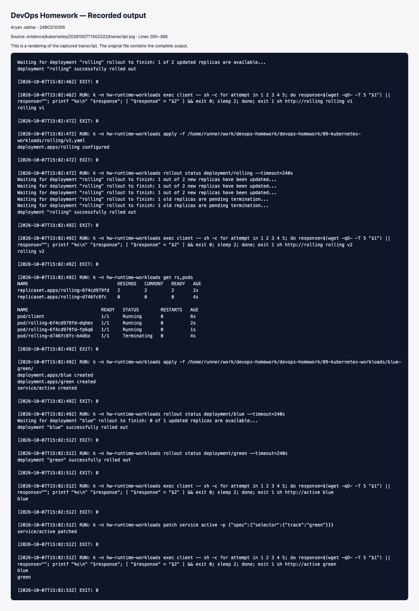
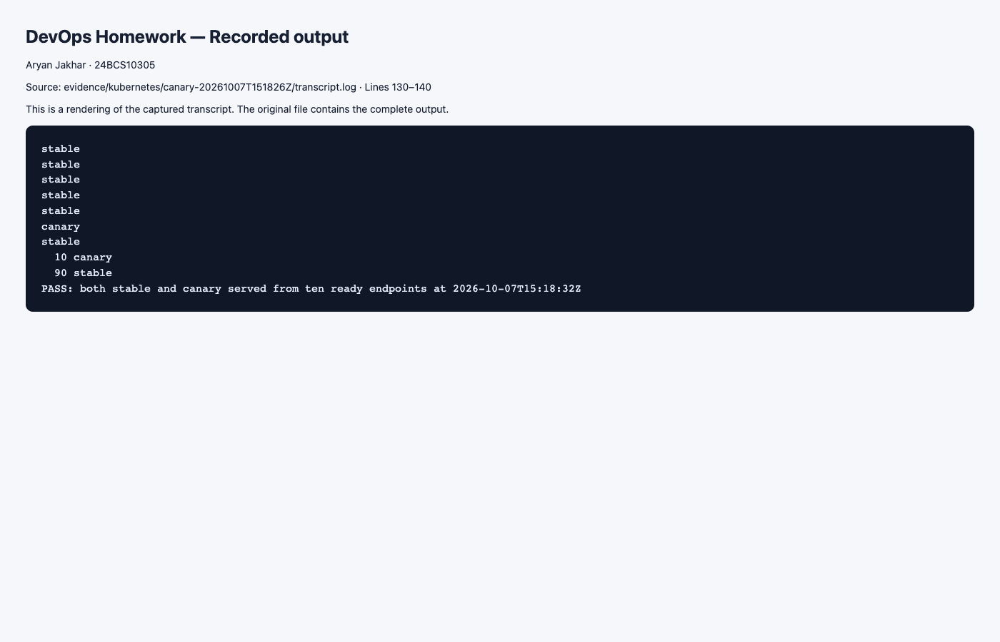

# Pods, ReplicaSets and Deployment Strategies

> Executed on 7 October 2026 using Kubernetes v1.34.0 and Minikube. The [runtime evidence index](../evidence/kubernetes/README.md) distinguishes the hosted run, its six runner-check failures, and targeted local repairs. Commands below remain a reproducible guide; the recorded-results section links observed output.

Run from this folder; first `kubectl create namespace hw-workloads`. All versions return their name/version as HTTP text, so traffic checks distinguish versions.

## Task 1: Four deployment strategies

```bash
# Rolling: run get pods -w in another terminal to watch overlap.
kubectl apply -n hw-workloads -f rolling/v1.yaml
kubectl rollout status -n hw-workloads deployment/rolling
kubectl apply -n hw-workloads -f rolling/v2.yaml
kubectl rollout status -n hw-workloads deployment/rolling
kubectl get -n hw-workloads rs,pods
kubectl rollout undo -n hw-workloads deployment/rolling
# Blue-green: both Deployments exist, one Service selector chooses traffic.
kubectl apply -n hw-workloads -f blue-green/
kubectl rollout status -n hw-workloads deployment/blue
kubectl rollout status -n hw-workloads deployment/green
kubectl run before -n hw-workloads --image=busybox:1.37 --restart=Never --attach --rm -- wget -qO- http://active
kubectl patch -n hw-workloads service active -p '{"spec":{"selector":{"track":"green"}}}'
kubectl run after -n hw-workloads --image=busybox:1.37 --restart=Never --attach --rm -- wget -qO- http://active
# Canary: nine stable Pods and one canary Pod share a Service.
kubectl apply -n hw-workloads -f canary/
kubectl rollout status -n hw-workloads deployment/stable
kubectl rollout status -n hw-workloads deployment/canary
kubectl run sample -n hw-workloads --image=busybox:1.37 --restart=Never --attach --rm -- sh -c 'for i in $(seq 1 100); do wget -qO- http://canary-route; done' | sort | uniq -c
# Recreate: wait for v1, then observe deletion before v2 creation.
kubectl apply -n hw-workloads -f recreate/v1.yaml
kubectl rollout status -n hw-workloads deployment/recreate
kubectl get -n hw-workloads pods -w
# Stop watch after baseline or use a second terminal:
kubectl apply -n hw-workloads -f recreate/v2.yaml
kubectl rollout status -n hw-workloads deployment/recreate
```

RollingUpdate retains available replicas during replacement (one extra allowed). Blue-green expected responses change from `blue` to `green`; rollback patches `track` to `blue`. Canary replica ratios approximate 10% new connections, **not** a guaranteed per-request traffic weight; connection reuse and small samples skew results. Recreate intentionally introduces downtime. Apply and scale `replicaset.yaml` to see direct replica management; a standalone ReplicaSet has no rollout history.

## Task 2: Pod lifecycle

For **each** file in `lifecycle/`, apply it, capture `get`, `describe`, logs and events, then delete it before moving on:

```bash
kubectl apply -n hw-workloads -f lifecycle/running.yaml
kubectl get -n hw-workloads pod running -o wide
kubectl describe -n hw-workloads pod running
kubectl logs -n hw-workloads running
kubectl get -n hw-workloads events --sort-by=.metadata.creationTimestamp
kubectl delete -n hw-workloads -f lifecycle/running.yaml
```

| File | Expected observation and explanation |
| --- | --- |
| running | Running while `sleep` keeps the container alive |
| pending | Pending; selector matches no node, reported in scheduling events |
| succeeded | Succeeded/Completed because exit code is zero with restartPolicy Never |
| failed | Failed/Error because exit code is one with restartPolicy Never |
| crashloop | Repeated exit code one with restartPolicy Always; restart count grows |
| imagepull | ErrImagePull then ImagePullBackOff because the tag does not exist |
| init | Init container completes its ten-second delay before main starts |
| multi-container | Two containers in one Pod; use `logs -c sidecar` |
| startup | Startup probe allows initialization before other probes can run |
| readiness | Initially not ready; becomes ready once `/tmp/healthy` exists |
| liveness | Starts healthy; removing `/tmp/healthy` triggers container restart |
| termination | Deletion sends TERM; process traps it and exits before grace expires |

For liveness run `kubectl exec -n hw-workloads liveness -- rm /tmp/healthy`, then watch restarts. For readiness remove the same file and watch READY become 0/1 without a restart. `CrashLoopBackOff`, `ImagePullBackOff`, and `ContainerCreating` are container/display statuses, not Pod phases. The Pod phases are Pending, Running, Succeeded, Failed and Unknown. Unknown reflects inability to obtain state and is not reliably produced by a portable Pod manifest.

Record actual before/after output, timestamps and screenshots for each file. Cleanup: `kubectl delete namespace hw-workloads`.

## Recorded runtime results

Rolling and Recreate deployments returned their v1 then v2 content; the blue/green Service switched from blue to green. Lifecycle fixtures produced the expected scheduling, image-pull, crash, completion and readiness states. The first liveness test ran before its delayed health file existed; the targeted repair waits for that file before testing a real restart. Canary sampling was repeated after all ten endpoints propagated and returned **90 stable / 10 canary** responses out of 100. This is an observed sample, not a guaranteed traffic ratio.

[Complete transcript](../evidence/kubernetes/20261007T150232Z/transcript.log) · [Evidence and repair details](../evidence/kubernetes/README.md).



### Individual lifecycle screenshots

These are labeled renderings of authentic recorded output, one for each YAML. Liveness uses the successful targeted repair transcript.

| Fixture | Captured observation |
| --- | --- |
| `crashloop.yaml` | [Recorded crashloop output](../evidence/kubernetes/20261007T150232Z/lifecycle/crashloop.png) |
| `failed.yaml` | [Recorded failed output](../evidence/kubernetes/20261007T150232Z/lifecycle/failed.png) |
| `imagepull.yaml` | [Recorded imagepull output](../evidence/kubernetes/20261007T150232Z/lifecycle/imagepull.png) |
| `init.yaml` | [Recorded init output](../evidence/kubernetes/20261007T150232Z/lifecycle/init.png) |
| `liveness.yaml` | [Recorded liveness output](../evidence/kubernetes/20261007T150232Z/lifecycle/liveness.png) |
| `multi-container.yaml` | [Recorded multi-container output](../evidence/kubernetes/20261007T150232Z/lifecycle/multi-container.png) |
| `pending.yaml` | [Recorded pending output](../evidence/kubernetes/20261007T150232Z/lifecycle/pending.png) |
| `readiness.yaml` | [Recorded readiness output](../evidence/kubernetes/20261007T150232Z/lifecycle/readiness.png) |
| `running.yaml` | [Recorded running output](../evidence/kubernetes/20261007T150232Z/lifecycle/running.png) |
| `startup.yaml` | [Recorded startup output](../evidence/kubernetes/20261007T150232Z/lifecycle/startup.png) |
| `succeeded.yaml` | [Recorded succeeded output](../evidence/kubernetes/20261007T150232Z/lifecycle/succeeded.png) |
| `termination.yaml` | [Recorded termination output](../evidence/kubernetes/20261007T150232Z/lifecycle/termination.png) |

The termination example also [logged its SIGTERM handler](../evidence/kubernetes/20261007T150232Z/lifecycle/termination-signal.png).


