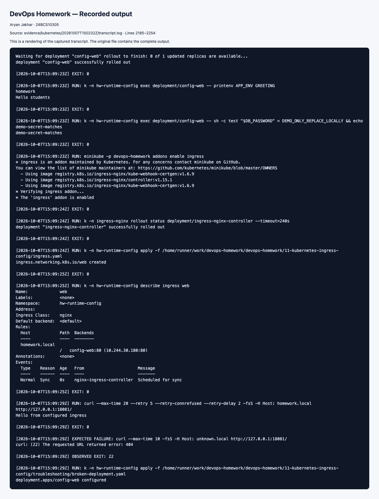

# Ingress, ConfigMaps and Secrets

> Executed on 7 October 2026 using Kubernetes v1.34.0 and Minikube. The [runtime evidence index](../evidence/kubernetes/README.md) distinguishes the hosted run, its six runner-check failures, and targeted local repairs. Commands below remain a reproducible guide; the recorded-results section links observed output.

## Tasks 1–2: Inject and verify configuration

```bash
kubectl create namespace hw-config
kubectl apply -n hw-config -f configmap.yaml
# Example YAML deliberately contains only a fake demo value:
kubectl apply -n hw-config -f secret.example.yaml
kubectl apply -n hw-config -f deployment.yaml
kubectl rollout status -n hw-config deployment/config-web
kubectl exec -n hw-config deployment/config-web -- printenv APP_ENV GREETING
kubectl exec -n hw-config deployment/config-web -- sh -c 'test "$DB_PASSWORD" = DEMO_ONLY_REPLACE_LOCALLY && echo "demo secret matches"'
```

Expected: `homework`, `Hello students`, and `demo secret matches`. The last check verifies the value without printing it. ConfigMaps hold nonsecret strings. Secret `data` is base64 encoding, not encryption; actual credentials must stay out of Git and command screenshots. This committed `stringData` example is a public fake value only. For real work create secrets through a secret manager or a protected local file and RBAC; do not replace the example with real credentials. Environment variable updates require a Pod restart (`kubectl rollout restart -n hw-config deployment/config-web`).

## Tasks 3–4: Ingress and controller

```bash
minikube addons enable ingress
kubectl rollout status -n ingress-nginx deployment/ingress-nginx-controller
kubectl apply -n hw-config -f ingress.yaml
kubectl get -n hw-config ingress
kubectl describe -n hw-config ingress web
# Portable local access to the installed controller, including macOS Docker driver:
kubectl port-forward -n ingress-nginx service/ingress-nginx-controller 8081:80
# Second terminal:
curl -H 'Host: homework.local' http://127.0.0.1:8081/
curl -H 'Host: unknown.local' http://127.0.0.1:8081/
```

Expected: configured host returns `Hello from configured ingress`; unknown host usually receives the controller's default 404. For direct access on a routable Minikube driver, use `curl --resolve "homework.local:80:$(minikube ip)" http://homework.local/`.

An **Ingress** is an API object describing HTTP host/path routing to Services. An **Ingress controller** watches these objects and configures a real proxy/load balancer. The manifest alone does not route traffic. Controllers include Traefik, HAProxy and provider-specific controllers. This disposable lab uses the controller installed by the Minikube ingress addon; match `ingressClassName` to the installed class (`kubectl get ingressclass`). The Service still selects application Pods.

## Task 5: Diagnose broken Secret injection

```bash
kubectl apply -n hw-config -f troubleshooting/broken-deployment.yaml
kubectl get -n hw-config pods
kubectl describe -n hw-config pods -l app=config-web
kubectl get -n hw-config secret app-secret -o jsonpath='{.data}'
# Restore the correct key without printing decoded secrets:
kubectl apply -n hw-config -f deployment.yaml
kubectl rollout status -n hw-config deployment/config-web
kubectl exec -n hw-config deployment/config-web -- sh -c 'test -n "$DB_PASSWORD" && echo configured'
```

Expected before: new Pod shows CreateContainerConfigError; events explain `WRONG_KEY` does not exist. Root cause: the reference names a nonexistent key, while the Secret contains DB_PASSWORD. Expected after: rollout completes and `configured` prints. Old healthy Pods may remain during the failed rolling update; inspect the **new** Pod. Record real before/after describe output, key names (redact values), HTTP responses and screenshots. Cleanup: `kubectl delete namespace hw-config`.

## Recorded runtime results

ConfigMap environment values and the public demonstration Secret matched. The Ingress returned the page for `homework.local` and HTTP 404 for an unknown host. A missing Secret reference produced `CreateContainerConfigError`; restoring the correct deployment completed the rollout.

[Complete transcript](../evidence/kubernetes/20261007T150232Z/transcript.log) · [Evidence and repair details](../evidence/kubernetes/README.md).


