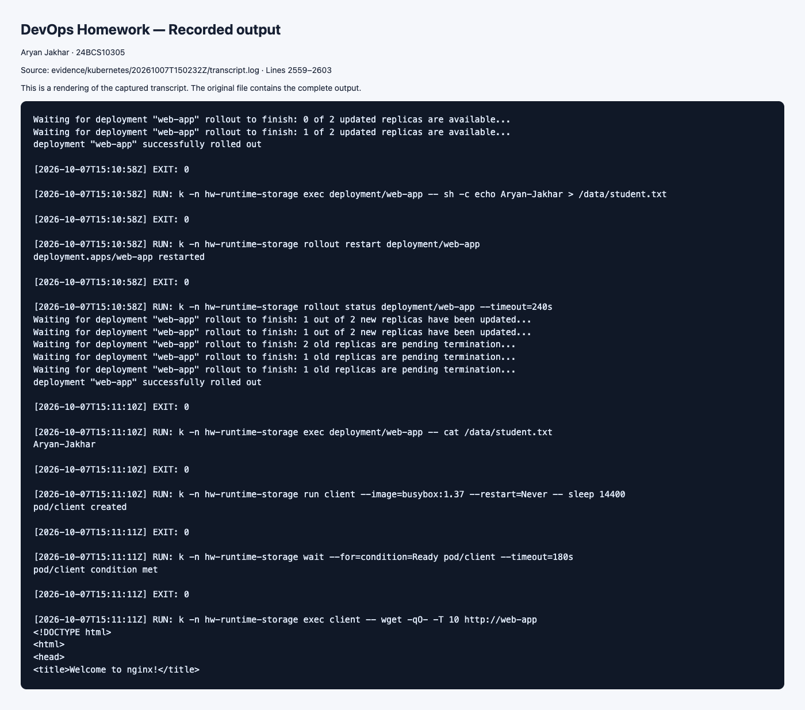
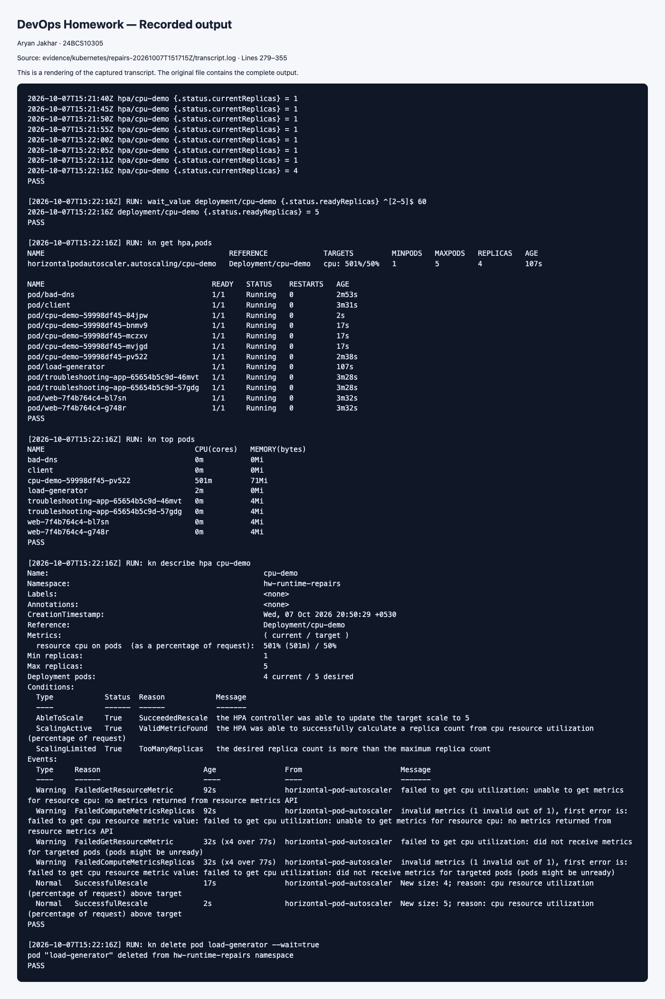
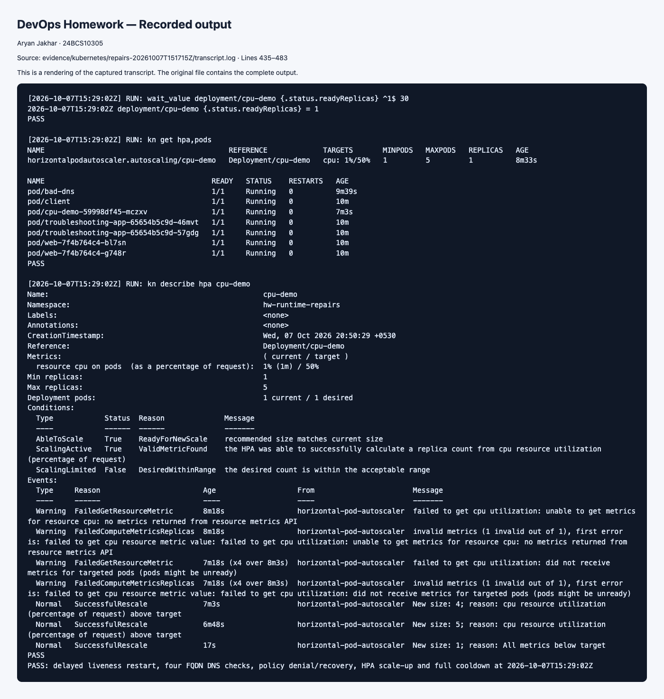

# Kubernetes Storage, HPA and Probes

> Executed on 7 October 2026 using Kubernetes v1.34.0 and Minikube. The [runtime evidence index](../evidence/kubernetes/README.md) distinguishes the hosted run, its six runner-check failures, and targeted local repairs. Commands below remain a reproducible guide; the recorded-results section links observed output.

## Task 1: Volumes

See [01-kubernetes-volumes](01-kubernetes-volumes/README.md) for emptyDir, hostPath, static PV/PVC and dynamic provisioning examples.

## Task 2: HPA and load generation

Use a disposable **single-node Minikube** cluster, with a default StorageClass and metrics-server. Run these commands from this folder:

```bash
kubectl create namespace hw-storage
minikube addons enable metrics-server
kubectl get storageclass
kubectl apply -n hw-storage -f hpa/application.yaml
kubectl apply -n hw-storage -f hpa/hpa.yml
kubectl rollout status -n hw-storage deployment/cpu-demo
kubectl get -n hw-storage hpa
kubectl top pods -n hw-storage
kubectl apply -n hw-storage -f hpa/load-generator.yaml
kubectl get -n hw-storage hpa -w
# Separate terminal:
kubectl get -n hw-storage pods
kubectl top pods -n hw-storage
kubectl describe -n hw-storage hpa cpu-demo
# Stop load and watch the stabilization period:
kubectl delete -n hw-storage -f hpa/load-generator.yaml
```

Expected: utilization rises above the 50% CPU-request target and desired replicas increase (up to five). This CPU-intensive sample makes load more visible than nginx static pages. Exact CPU percentages/counts depend on available capacity and traffic; they are not guaranteed. Unknown metrics require checking metrics-server and CPU requests. Scaling down commonly waits several minutes. Record actual idle, loaded and cooldown HPA/Pod/metrics output and screenshots.

## Task 3: Mini project

[Mini project](mini-project/README.md) combines persistent storage, HTTP Service, HPA and all three probes. Cleanup after both exercises: `kubectl delete namespace hw-storage`. PVC deletion may destroy dynamically provisioned data; run only in this disposable lab. Static retained PV cleanup is documented separately.

## Recorded runtime results

The emptyDir file disappeared after Pod replacement. Static PV and dynamically provisioned PVC files survived replacement; the web application returned its page and retained `Aryan-Jakhar`. The hosted CPU demo eventually reached five ready replicas, though its first 90-second observation window showed unknown HPA metrics. The targeted local run captures the full scaling and cooldown checks. Readiness failure and subsequent repair are recorded in the hosted transcript.

[Complete transcript](../evidence/kubernetes/20261007T150232Z/transcript.log) · [Evidence and repair details](../evidence/kubernetes/README.md).







The local recovery run [passed](../evidence/kubernetes/repairs-20261007T151715Z/result.txt) at 15:29:02 UTC, including the full return to one replica after stopping load.
