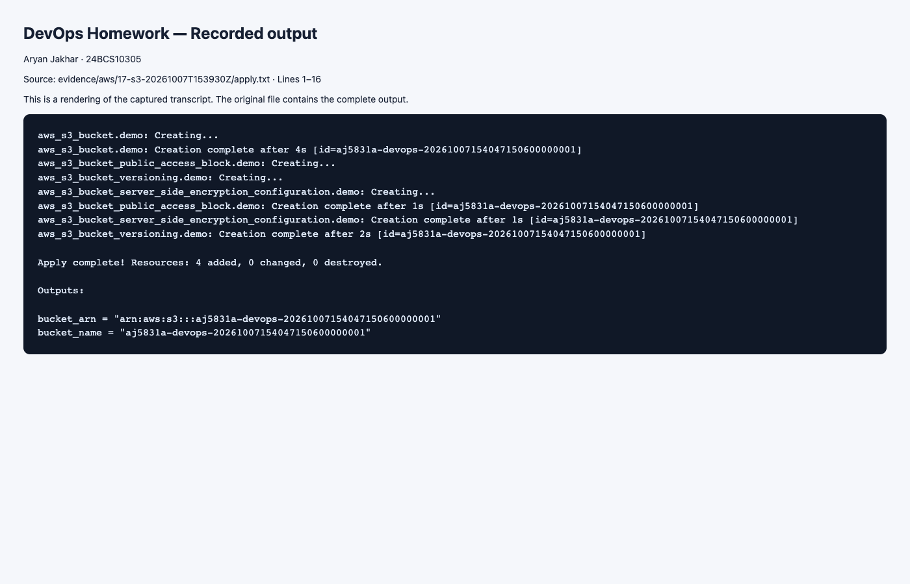
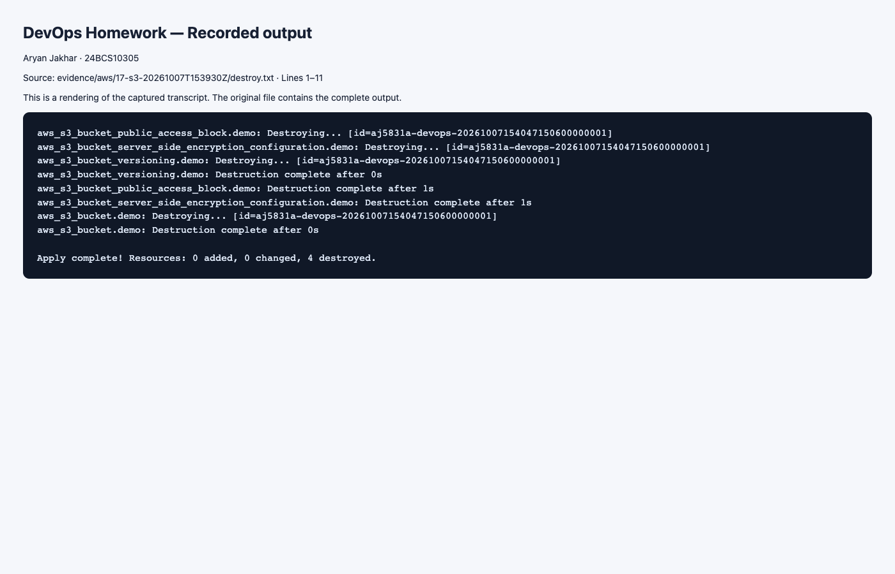

# Task 1: Terraform S3 Demo

This project creates a private, versioned, AES-256 encrypted S3 bucket. `provider.tf` pins a compatible AWS provider major version; variables are defined separately; `main.tf` describes resources; outputs expose the resulting name and ARN. `bucket_prefix` lets Terraform generate a unique name without borrowing another student's bucket or account details.

## Commands

Prerequisites: Terraform >=1.6, AWS CLI, and a logged-in AWS profile with permission to manage this lab's S3 resources. From this folder:

```bash
export AWS_PROFILE=devops-lab
export AWS_DEFAULT_REGION=ap-south-1
# Bridge AWS CLI login credentials to the Terraform 5.x AWS provider.
# This evaluates trusted AWS CLI exports; do not print the values or use shell xtrace.
eval "$(aws configure export-credentials --profile "$AWS_PROFILE" --format env)"
aws sts get-caller-identity
terraform init
terraform fmt
terraform validate
terraform plan -out=tfplan
terraform apply tfplan
terraform show
terraform output
aws s3api get-public-access-block --bucket "$(terraform output -raw bucket_name)"
aws s3api get-bucket-versioning --bucket "$(terraform output -raw bucket_name)"
aws s3api get-bucket-encryption --bucket "$(terraform output -raw bucket_name)"
terraform plan
terraform destroy
unset AWS_ACCESS_KEY_ID AWS_SECRET_ACCESS_KEY AWS_SESSION_TOKEN AWS_CREDENTIAL_EXPIRATION
```

`init` installs providers; `fmt` normalizes code; `validate` checks configuration; `plan` previews changes; `apply` executes the saved plan; `show` displays state/resources; `output` reads declared outputs; `destroy` previews and removes managed infrastructure after confirmation. A second plan after successful apply should show no changes.

`terraform.tfvars` contains only non-secret lab defaults. Use the AWS credential chain (SSO/profile/environment) instead of putting credentials into Terraform. For this captured run, a Python runner called `aws configure export-credentials --profile devops-lab --format process`, parsed the JSON in memory and supplied temporary credentials only in child-process environment variables. It did not rely on the Terraform AWS provider 5.x reading the newer AWS CLI login-session cache directly. No credential values were written to files or transcripts. The shell equivalent above exports them for this lab and clears them afterward.

State maps configuration addresses to AWS resource IDs and can contain sensitive values. Keep `.terraform/`, state, plans and crash logs out of Git; commit `.terraform.lock.hcl` after a successful init. Local state is sufficient for this individual exercise; team use needs a secured remote backend with locking.

## Verification and evidence

Executed in AWS `ap-south-1` on 7 October 2026 using authenticated profile `devops-lab`. Terraform created four resources, and AWS API checks verified all four public-access blocks, versioning `Enabled` and AES256 encryption. A second plan showed no changes. Destroy removed all four resources; Terraform state was empty and `HeadBucket` returned 404 afterward. The [evidence index](../../evidence/aws/17-s3-20261007T153930Z/README.md) contains real command output, including `terraform show`, and screenshots rendered from those transcripts. Account identifiers and the learner IP were redacted; state, credentials and saved plans stayed outside Git.





The bucket starts empty. `force_destroy=false` prevents silently deleting uploaded objects. If you add objects, deliberately remove all versions and delete markers before destroy; deleting only current keys does not empty a versioned bucket. Retain the state until cleanup succeeds.

References: [Terraform AWS tutorial](https://developer.hashicorp.com/terraform/tutorials/aws-get-started), [provider configuration](https://developer.hashicorp.com/terraform/language/block/provider).
