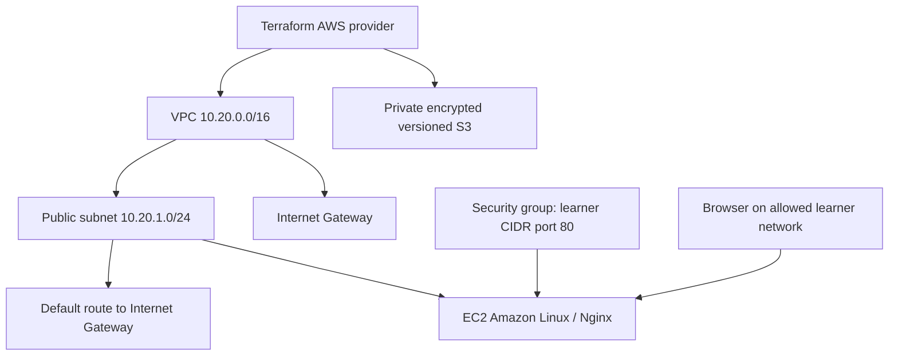

# Cloud & Terraform in Action — Session 19

The [Terraform project](terraform-vpc/) implements the PDF's full suggested architecture: VPC, subnet, security group, EC2 and S3. It extends the reference's VPC/network-only implementation with a working Nginx EC2 bootstrap and private object storage. Terraform formatting, initialization and validation passed in hosted CI ([evidence](../evidence/infrastructure/README.md)). AWS apply and runtime screenshots are **pending**, not claimed as completed.



S3 is a separate regional service, not a resource inside the subnet. The EC2 web page is served from its root disk; no EC2-to-S3 permission is needed for this demo.

## Implementation

- **Provider:** `hashicorp/aws` with region and common tags; version constraints are explicit.
- **Variables:** region, EC2 instance type, allowed HTTP CIDR and bucket prefix.
- **Data sources:** an available zone and an Amazon-owned AL2023 x86_64 AMI, avoiding hard-coded account-specific IDs.
- **Resources:** VPC, public subnet, Internet Gateway, route table/association, security group, EC2, encrypted root disk and secured S3 bucket.
- **Dependencies:** references connect subnet → VPC and EC2 → subnet/security group. An explicit dependency waits for the route association before bootstrapping packages.
- **Outputs:** VPC/subnet/instance IDs, web URL and bucket name.
- **State:** Terraform records resource IDs and configuration bindings locally. Do not commit state or plans; preserve state until destroy finishes. For teams use a separately bootstrapped secured remote backend with locking, not the bucket that this same root module destroys.

## Run and verify

Requires Terraform >=1.6, authenticated AWS CLI and permission to create these resources. EC2, EBS, public IPv4 and S3 may incur charges; destroy the lab afterward.

```bash
cd terraform-vpc
cp terraform.tfvars.example terraform.tfvars
# Edit http_cidr to your actual public IPv4 /32 before planning.
export AWS_PROFILE=your-lab-profile
aws sts get-caller-identity
terraform init
terraform fmt
terraform validate
terraform plan -out=tfplan
terraform apply tfplan
terraform show
terraform output
aws ec2 wait instance-status-ok --instance-ids "$(terraform output -raw instance_id)"
# Cloud-init package installation may take a few additional minutes.
curl --fail --retry 12 --retry-delay 10 --retry-connrefused "$(terraform output -raw web_url)"
aws s3api get-public-access-block --bucket "$(terraform output -raw bucket_name)"
terraform plan
terraform destroy
```

Expected verification: HTTP contains `Hello from Terraform on AWS`, S3 blocks public access, and a second plan shows no changes. These are acceptance criteria, not captured results. Record actual init/validate/plan/apply/output/destroy transcripts and browser/AWS resource screenshots in `evidence/` before submission. The S3 bucket must be empty (including object versions) for destroy because force deletion is disabled.

## Troubleshooting

| Symptom | Investigation | Resolution |
|---|---|---|
| Credentials error | `aws sts get-caller-identity` | Sign into the intended profile and export it in the Terraform shell. |
| HTTP timeout | Check current public IP, SG, subnet route, public IP and instance status. | Set the correct `/32`, apply changes, and allow bootstrap time. |
| HTTP connection refused | Inspect EC2 console/system log for cloud-init and `dnf` failure. | Fix bootstrap/network access, then `terraform apply -replace=aws_instance.web`. |
| AMI/type mismatch | Compare AMI architecture with instance type. | Use an x86_64 type with the supplied AMI filter. |
| BucketNotEmpty on destroy | Inspect versions/delete markers. | Deliberately remove lab objects/versions, then retry destroy. |

This lab uses HTTP and a single public instance to demonstrate dependencies; it has no TLS, load balancer, HA or cluster. A newly published matching AMI can produce a replacement plan because the lookup uses `most_recent`; review each plan or pin an AMI for repeatable longer-lived deployments.

References: [Terraform AWS getting started](https://developer.hashicorp.com/terraform/tutorials/aws-get-started), [AWS VPC](https://docs.aws.amazon.com/vpc/latest/userguide/what-is-amazon-vpc.html).
