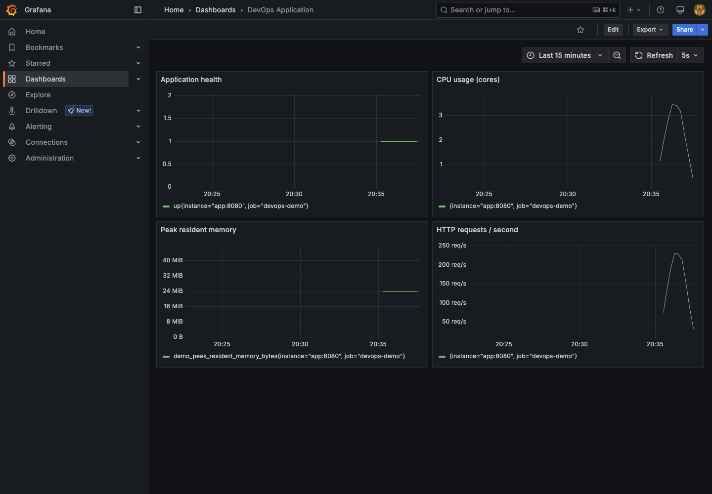
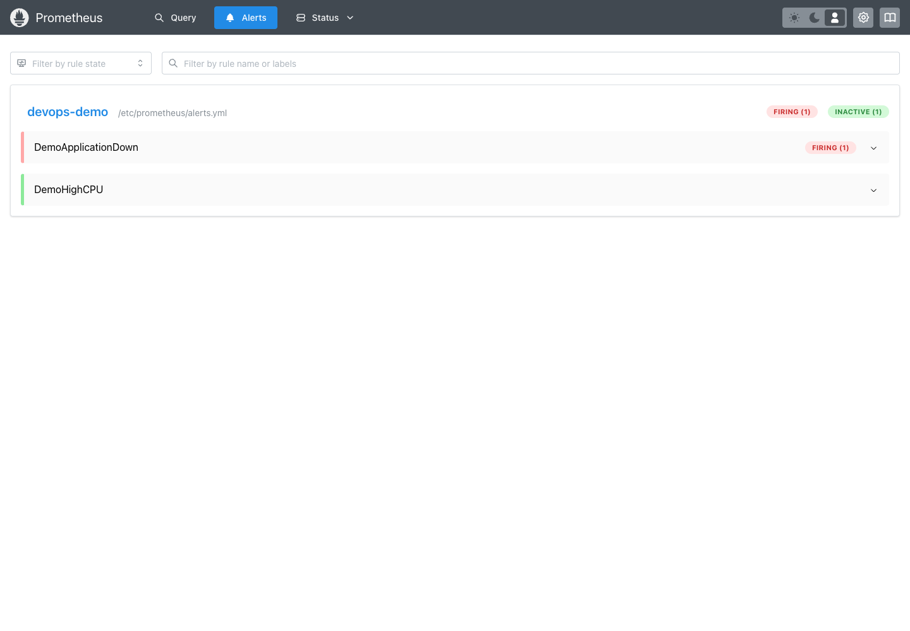

# Monitoring, Observability & GitOps

Session 20. The monitoring lab ran locally on 7 October 2026 using Docker,
Prometheus and Grafana. [Runtime evidence](evidence/README.md) includes dashboard
screenshots, metrics, request logs and verified alert firing/recovery.
The GitOps procedure and its execution status are documented in Task 3 below.

## Task 1: Monitoring demo

From this folder, start the final project's instrumented Python application,
Prometheus, and Grafana. Grafana automatically loads a dashboard and datasource.

```bash
export API_TOKEN="$(python3 -c 'import secrets; print(secrets.token_hex(24))')"
export GRAFANA_PASSWORD="$(python3 -c 'import secrets; print(secrets.token_hex(24))')"
docker compose up -d --build
docker compose ps
curl -fsS http://localhost:8080/healthz
curl -fsS http://localhost:8080/metrics
docker compose logs --tail=20 app
```

Open Prometheus at `http://localhost:9090/targets` (target should be UP) and
Grafana at `http://localhost:3000` (user `admin`, password from your shell).
The **DevOps Application** dashboard shows health, CPU cores, peak resident
memory and requests/second. Peak memory is a high-water mark, not current RSS.
Use `docker stats --no-stream` to observe current container CPU/memory as well.

```bash
# Generate CPU activity; Ctrl-C to stop.
while true; do curl -fsS 'http://localhost:8080/work?rounds=100000' >/dev/null; done
# In another terminal:
docker stats --no-stream
# Trigger the down alert, wait at least 40 seconds, inspect /alerts in Prometheus.
docker compose stop app
# Restore health; the alert resolves after the next evaluations.
docker compose start app
```

`alerts.yml` has a down alert (30 seconds) and high CPU alert (one minute).
Prometheus evaluates these and displays pending/firing/resolved state. This lab
has no external notification receiver; Alertmanager is needed to route emails
or messages. Capture dashboard graphs, `docker stats`, logs and alert transitions.
The CPU alert may need several concurrent load loops to exceed its threshold.

### Recorded monitoring results

The application was healthy and Prometheus scraped it successfully. Four
concurrent `/work?rounds=100000` loops produced 357.42% container CPU usage
(about 3.57 cores) and a peak resident-memory metric of 24,809,472 bytes.
Grafana displayed health, CPU, memory and request-rate graphs. Prometheus
recorded `DemoHighCPU` firing during this load. Stopping the app then triggered
`DemoApplicationDown`; restarting it cleared the alert. The captured run used
`APP_PORT=18089` to avoid other lab services.






See [raw commands and evidence](evidence/README.md).

## Task 2: Observability

| Pillar | Meaning | Demo/tool |
| --- | --- | --- |
| Metrics | Numeric measurements sampled over time; answer how much/how often | Prometheus counter/rate, CPU, memory, health; Grafana |
| Logs | Timestamped events explaining individual requests/errors | App emits JSON status, path, duration and request ID to stdout |
| Traces | Linked spans following a request across services | OpenTelemetry + Jaeger/Tempo; conceptual here, no tracing backend installed |

Monitoring tells us a known condition is bad; combining these signals helps
investigate why. A request ID links local logs but is not a distributed trace.
In Kubernetes, use `kubectl logs`, Events and `kubectl top`; metrics-server
supplies resource metrics for HPA, while Prometheus stores time series for
queries and alerts. kube-state-metrics exposes desired/available replica counts;
a node exporter supplies host-level metrics. An OTel collector can forward
telemetry and trace context between services.

## Task 3: GitOps demo

Prerequisites: reachable cluster, Argo CD installed, this repository pushed to
GitHub and readable by Argo CD. Follow the official Argo CD installation guide
for your selected release, then apply this Application:

```bash
kubectl apply -f application.yaml
kubectl -n argocd get application monitoring-gitops-lab
kubectl -n gitops-lab rollout status deployment/gitops-web --timeout=180s
kubectl -n gitops-lab get pods,svc
kubectl -n gitops-lab port-forward svc/gitops-web 8081:80
# Separate terminal:
curl -fsS http://localhost:8081
```

Git stores the desired YAML; Argo CD continually compares it with the cluster.
Edit `gitops/deployment.yaml` replicas from 2 to 3, commit and push. Wait for
Argo to sync; verify three ready Pods. To demonstrate drift repair:

```bash
kubectl -n gitops-lab scale deployment gitops-web --replicas=1
kubectl -n gitops-lab get pods -w
```

Self-heal restores the count declared in Git. Revert the commit and push to
perform a GitOps rollback. Record the commit SHA, Argo sync/health status and
Pod counts before/after; these are expected outcomes until actually executed.

Cleanup: delete the Argo Application first to stop reconciliation, then delete
the dedicated `gitops-lab` namespace. `docker compose down` stops monitoring;
add `--volumes` only if you also want to discard the lab dashboards/history.

References: [Prometheus rules](https://prometheus.io/docs/prometheus/latest/configuration/alerting_rules/),
[Argo CD declarative setup](https://argo-cd.readthedocs.io/en/stable/operator-manual/declarative-setup/).
