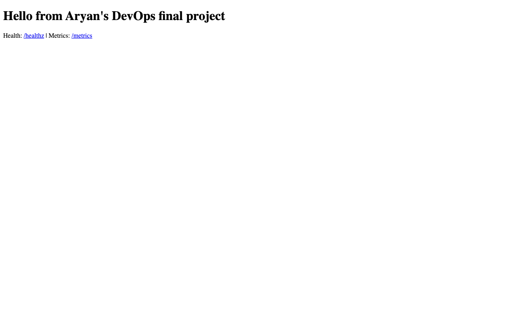

# Final project: real AWS lifecycle

Executed on **7 October 2026** in **ap-south-1** with Terraform 1.9.8 and
AWS provider 5.100.0. The final infrastructure module created 11 resources,
bootstrapped k3s, served the previously gated application through Traefik,
and was completely destroyed after verification. The EC2 address in these
records is historical; there is no running final-project cloud service.

## Observed results

| Requirement | Evidence |
| --- | --- |
| Provider initialization and validation | `init.txt`, `validate.txt` |
| Reviewed plan: 11 additions | `plan.txt` |
| Apply: 11 created; actual IDs/output/state display | `apply.txt`, `outputs.json`, `show.txt` |
| Trusted SSH host authentication | `host-verification.txt`: ED25519 key matched authenticated AWS EC2 console output before strict SSH |
| Amazon Linux 2023 and k3s Ready | `bootstrap.txt`, `nodes.txt`: k3s v1.36.5+k3s1 |
| Exact previously scanned image | `image-import.txt`, `provenance.json` |
| Helm installation | `helm.txt`: deployed revision 1 |
| Two ready Pods, Service, Traefik Ingress, HPA metrics | `resources.txt`, `cluster-services.txt` |
| Real HTTP readiness through EC2 Ingress | `readiness-headers.txt`: HTTP 200; `readiness.json`: ready true |
| Real browser application through the same Ingress | `application-browser.png`, `browser-result.json` |
| Structured application request logs | `application-logs.txt` |
| Workload removal and reviewed destroy plan | `workload-cleanup.txt`, `destroy-plan.txt` |
| Terraform destruction: 11 removed | `destroy.txt` |
| Independent AWS cleanup queries | `cleanup-verification.json`: all checks passed |
| Empty Terraform state resource list | `state-list-after-destroy.txt` (intentionally empty) |

The browser used Chromium's `--host-resolver-rules=MAP devops.local 13.233.196.178`
and navigated to `http://devops.local`. This routed the real request to EC2
with the Ingress hostname; no hosts-file edits or fabricated responses were used.

## Reproducibility and credentials

The profile was authenticated with AWS CLI login. Because provider 5.x did not
consume that login profile directly, a private Python wrapper invoked
`aws --profile devops-lab --region ap-south-1 configure export-credentials --format process`,
parsed the result in memory, and supplied its temporary credentials only in
the Terraform subprocess environment. No credential values were printed or
saved. The explicit region fixed an initial cleanup-wrapper `NoRegion` error;
that error occurred before Terraform started, and the same reviewed destroy
plan subsequently completed.

State, binary saved plans, private tfvars, the temporary ED25519 private key and
cluster-admin kubeconfig stayed in a mode-0700 directory outside the repository.
The private key, kubeconfig, tfvars and binary plans were removed after teardown.
The temporary AWS key pair was also deleted and its absence independently checked.
The committed text evidence redacts only the operator's public IPv4 address and
AWS account number, using explicit placeholders. Resource IDs and the temporary
EC2 address are retained for auditability. No state or credential files are committed.

The deployed image is
`ghcr.io/aj5831a/devops-final:be9442981c475a39475f4f14501e0fc95244b681`,
from [successful pipeline 37640204903](https://github.com/AJ5831A/devops-homework/actions/runs/37640204903).
The saved, scanned image artifact was transferred through verified SSH and
imported/tagged in remote k3s containerd. It was not rebuilt; the artifact's
SHA-256 and manifest digest are retained. This import avoids requiring private
GHCR pull credentials and does not claim a fresh registry download.

The node was x86_64, matching the gated image. kubectl 1.37.1 was used against
k3s 1.36.5, within one minor version. The chart enabled HPA and Traefik Ingress;
the Secret was generated at runtime and never committed. The AMI's existing
curl was used, avoiding an AL2023 curl/curl-minimal package conflict.

Cleanup verified the instance is terminated; its root EBS volume, VPC, subnet,
security group, route table, Internet Gateway, empty private S3 bucket and
temporary key pair no longer exist; no network interfaces remain for the VPC.
The final module created no NAT gateway, load balancer, Elastic IP, snapshots or
IAM resources requiring additional cleanup. The k3s ServiceLB ran on the EC2 node.
