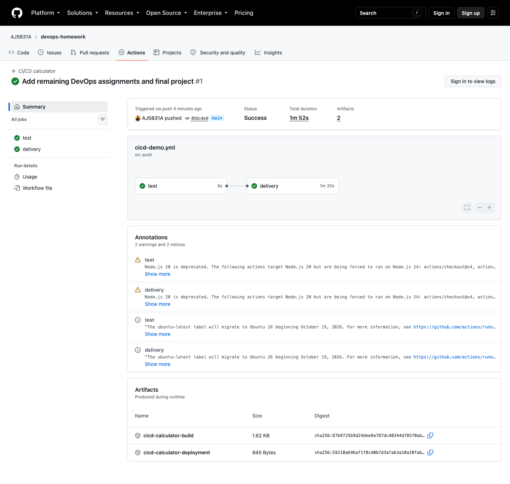
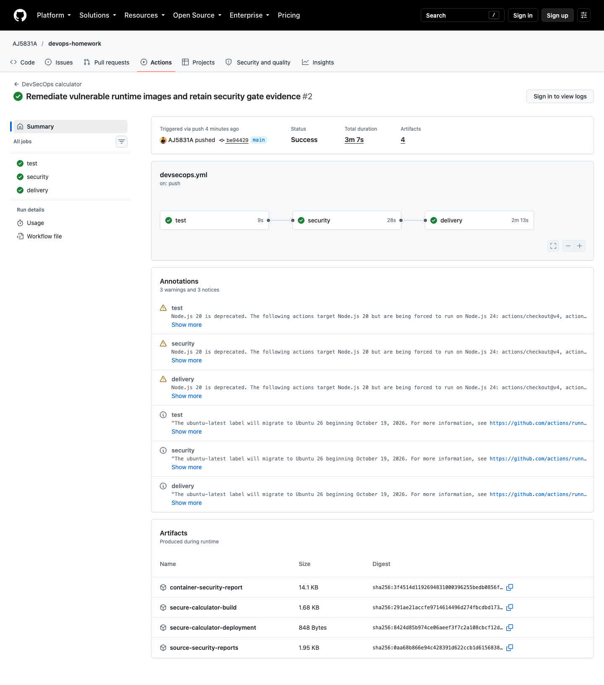

# Pipeline execution evidence

These are actual GitHub Actions logs, downloaded deployment artifacts and screenshots from this repository on 7 October 2026.

| Pipeline | Successful run | Source commit | Verified outcome |
|---|---|---|---|
| CI/CD calculator | [37639824089](https://github.com/AJ5831A/devops-homework/actions/runs/37639824089) | `8fdc4e970d759eac156516101c33e64b5cf6f065` | Tests, image publication, two ready Kubernetes replicas, health and arithmetic HTTP checks |
| DevSecOps calculator | [37640204904](https://github.com/AJ5831A/devops-homework/actions/runs/37640204904) | `be9442981c475a39475f4f14501e0fc95244b681` | Tests, SAST, SCA, secret scanning, image security gate, GHCR publication, rollout and HTTP checks |
| Final DevOps project | [37640204903](https://github.com/AJ5831A/devops-homework/actions/runs/37640204903) | `be9442981c475a39475f4f14501e0fc95244b681` | Tests, security gates, Helm validation, image publication, Helm deployment and readiness smoke test |

## Failure, remediation and successful verification

The initial DevSecOps and final-project runs correctly stopped at container scanning. The final-project report found 44 HIGH and zero CRITICAL findings in the Debian slim base packages. The original [final-project failure log](initial-final-image-gate-failure.log) and [DevSecOps failure log](initial-security-image-gate-failure.log) are retained.

The [remediation](image-remediation.md) changed the affected runtimes to the official Python Alpine image and applied distribution updates during the build. HIGH/CRITICAL gates remained blocking, including unfixed vulnerabilities. No vulnerability was ignored, and no failed security step was made optional. The successful runs above subsequently verified the rebuilt images before publication and deployment.

## Logs and artifacts

- CI/CD: [deployment output](cicd-success/deployment-evidence.txt), [health JSON](cicd-success/health.json), [calculation JSON](cicd-success/calculator.json), [port-forward log](cicd-success/port-forward.log).
- DevSecOps: [complete workflow log](devsecops-success/workflow.log), [deployment output](devsecops-success/deployment-evidence.txt), [health JSON](devsecops-success/health.json), [calculation JSON](devsecops-success/calculator.json).
- Final project: [complete workflow log](final-success/workflow.log), [pod/service and Helm output](final-success/deployment-evidence.txt).

Security reports and build artifacts can also be downloaded from the corresponding run while GitHub retains them. A terminating old calculator pod in the deployment snapshots is normal rolling-update cleanup; both new replicas are ready and rollout/HTTP checks passed. The kind clusters were ephemeral and were removed when their runner jobs finished.

## Screenshots

### CI/CD calculator

### DevSecOps calculator

### Final DevOps project

## Evidence scope

The run IDs and commits above identify exactly what was executed. Additional **Test application inside the built runtime** steps were added to the DevSecOps/final workflows after commit `be9442981c475a39475f4f14501e0fc95244b681`. These historical successes do not prove those later steps ran; the next run containing the changes provides that verification. Later documentation changes likewise do not alter the source commit represented by these logs.
