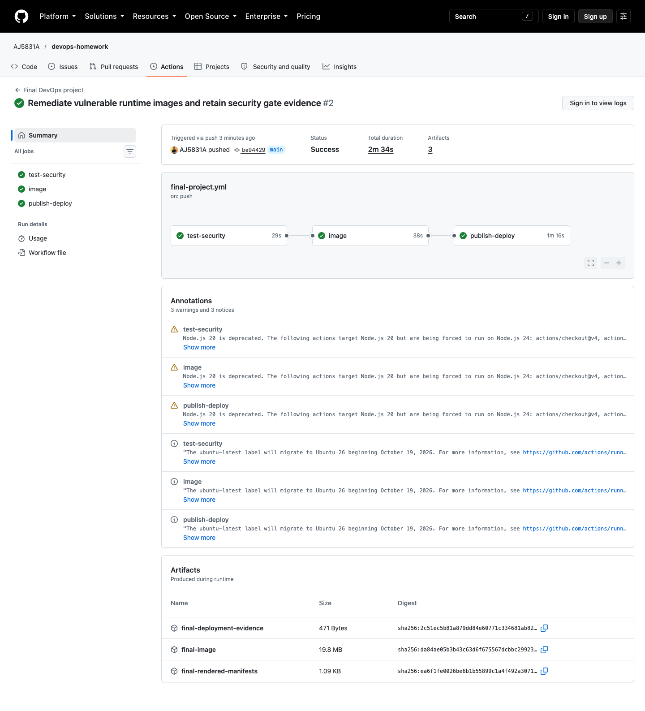
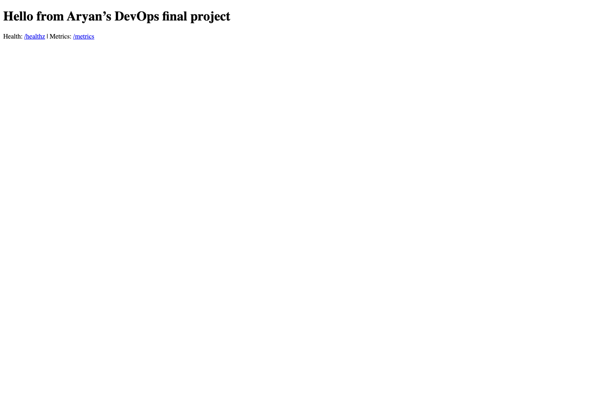

# Final DevOps Project & Troubleshooting

**Aryan Jakhar — 24BCS10305** · Session 21

A stateless Python HTTP service demonstrates the complete delivery chain. The
friend's repository was used to understand the lab style; this implementation
adds the PDF's CI/CD, Kubernetes, Helm, Terraform, security, monitoring and
GitOps requirements. Application tests, security gates, image publication and hosted Helm/Kubernetes
smoke deployment have passed. Local cloud/runtime lab work is tracked in
[validation](../VALIDATION.md).

## Observed pipeline execution

[Successful run 37640204903](https://github.com/AJ5831A/devops-homework/actions/runs/37640204903)
built and scanned commit `be9442981c475a39475f4f14501e0fc95244b681`, published its
image, deployed two replicas with Helm into kind, and received successful
readiness through the Service. [Actual logs and artifacts](../evidence/pipelines/final-success/)
are retained. The GitOps values now promote that verified SHA.





## Architecture and technologies

```text
Git / GitHub -> Actions: test -> SAST / SCA / secret scan
                                    |
                               Docker build -> Trivy security gate
                                    |
                               GHCR image :commit-SHA
                                    |
                               kind + Helm smoke deployment
                                    |
                      promote SHA in Git after successful CI
                                    |
                           Argo CD -> Helm -> Kubernetes
                                    |
              Ingress -> Service -> Python Pods -> stdout logs
                                    |
                              Prometheus -> Grafana

Terraform -> AWS VPC / subnet / routing / security group / EC2 k3s / S3
```

The service is stateless so HPA replicas can be freely created and removed.
Application storage is unnecessary; Prometheus/Grafana may use persistent
volumes, and Terraform supplies a private S3 bucket for lab artifacts. The
storage assignment separately demonstrates PVC-backed application data.

## Application setup

Run from this folder with Python 3.12+:

```bash
python3 -m unittest discover -s application -v
export API_TOKEN="$(python3 -c 'import secrets; print(secrets.token_hex(24))')"
python3 application/app.py
# Another terminal; use the same locally retained API_TOKEN for the API call:
curl -fsS http://localhost:8080/healthz
curl -fsS http://localhost:8080/readyz
curl -fsS http://localhost:8080/metrics
curl -fsS -H "Authorization: Bearer $API_TOKEN" http://localhost:8080/api/info
```

`/` renders the ConfigMap message, `/healthz` checks the process, `/readyz`
requires a configured secret, `/api/info` checks a bearer token, `/metrics`
exports counters/CPU/peak memory, and bounded `/work?rounds=100000` generates
CPU load. Each request emits JSON logs with a request ID, status and duration.

## Docker setup

```bash
docker build -t devops-final:local -f docker/Dockerfile .
docker run -d --name devops-final -p 127.0.0.1:8080:8080 \
  -e API_TOKEN --read-only --cap-drop ALL devops-final:local
curl -fsS http://localhost:8080/readyz
docker logs devops-final
docker rm -f devops-final
# Alternative; uses the same exported API_TOKEN:
docker compose -f docker/compose.yaml up -d --build
```

## Kubernetes deployment

Use a dedicated Minikube lab cluster with Docker available. The native manifests
use namespace `devops-final`, image `devops-final:local`, ingress class `nginx`.

```bash
minikube start --profile devops-final
kubectl config use-context devops-final
minikube -p devops-final addons enable ingress
minikube -p devops-final addons enable metrics-server
minikube -p devops-final image load devops-final:local
kubectl apply -f kubernetes/namespace.yaml
kubectl -n devops-final create secret generic devops-demo-secret \
  --from-literal=API_TOKEN="$API_TOKEN" --dry-run=client -o yaml | kubectl apply -f -
kubectl apply -f kubernetes/
kubectl -n devops-final rollout status deployment/devops-demo --timeout=180s
kubectl -n devops-final get pods,svc,ingress,hpa
kubectl -n devops-final port-forward svc/devops-demo 8080:80
```

`secret.yaml.example` is deliberately not applied by `kubectl apply -f`.
Never commit the real Secret output. Test `curl http://localhost:8080/readyz`
in another terminal. On a reachable Minikube IP, test Ingress with
`curl -H 'Host: devops.local' http://$(minikube -p devops-final ip)`.
Docker-driver networking on macOS may require `minikube tunnel`; use the
controller's reachable address. Port-forward verifies the Service but does not
prove Ingress routing, so record both separately.

Startup/liveness probes use `/healthz`; readiness uses `/readyz`. CPU requests
are configured so the HPA can calculate utilization. Generate load with several
parallel loops requesting `/work?rounds=100000`, then observe:

```bash
kubectl -n devops-final get hpa -w
kubectl -n devops-final top pods
kubectl -n devops-final describe hpa devops-demo
```

Expected: CPU rises and HPA increases replicas up to 5; scale-down follows its
stabilization window. Capture actual values rather than assuming scaling.

## Helm deployment

Helm is an alternative owner for the application resources. If the native demo
is running, delete its Deployment, Service, ConfigMap, Ingress and HPA first;
retain the namespace and Secret. Do not install over objects owned by kubectl.

```bash
helm lint helm/devops-demo
helm template devops-demo helm/devops-demo -n devops-final
helm upgrade --install devops-demo helm/devops-demo -n devops-final \
  --set ingress.enabled=true --set hpa.enabled=true --wait --timeout 180s
helm -n devops-final list
helm -n devops-final history devops-demo
helm upgrade devops-demo helm/devops-demo -n devops-final --reuse-values \
  --set message='Updated through Helm' --wait --timeout 180s
# After verifying the update:
helm -n devops-final rollback devops-demo 1 --wait --timeout 180s
```

For a published image, set `image.repository=ghcr.io/aj5831a/devops-final` and
`image.tag=<successful-commit-SHA>`. Make the GHCR package public or configure
pull credentials before external cluster use. Use release name `devops-demo`
so the supplied ServiceMonitor label matches.

## Terraform infrastructure

Follow [terraform/README.md](terraform/README.md) to provision the AWS lab and
retrieve a local kubeconfig. Fill in your IP CIDRs and existing EC2 key pair,
review `terraform plan`, then apply. The single EC2 node runs k3s with Traefik
and metrics-server. Deploy the published image using the Helm command above,
adding `--set ingress.className=traefik`. Local Minikube image loading is not
applicable to this remote cluster. AWS output and execution evidence are pending.

## CI/CD and DevSecOps

The active workflow is [root final-project.yml](../.github/workflows/final-project.yml).
The copy under this project's `.github/workflows` satisfies the required
submission structure; GitHub only executes repository-root workflows.

Pushes/PRs test and scan the application. Successful main-branch runs publish
the scanned image and deploy it into a fresh kind cluster using Helm, then
request readiness through the Kubernetes Service. Actions artifacts retain the
rendered chart, scanned image and successful deployment output. This is an
ephemeral test cluster; persistent delivery uses GitOps below. The successful run above provides the hosted execution evidence.

See [security/README.md](security/README.md) for SAST, SCA, secret and image
scanning gates. The runtime is stdlib-only; image scanning covers OS/Python
vulnerabilities. `GITHUB_TOKEN` supplies registry credentials without committing
keys. Failed security gates stop image publication and deployment.

## Monitoring and logs

For local Docker monitoring, follow [Session 20](../19-monitoring-gitops/README.md).
For Kubernetes, install the Prometheus operator stack, then the ServiceMonitor:

```bash
helm repo add prometheus-community https://prometheus-community.github.io/helm-charts
helm repo update
helm upgrade --install monitoring prometheus-community/kube-prometheus-stack \
  -n monitoring --create-namespace -f monitoring/values.yaml --wait --timeout 10m
kubectl apply -f monitoring/servicemonitor.yaml
kubectl -n devops-final logs deployment/devops-demo --tail=30
kubectl -n monitoring get pods,svc
kubectl -n monitoring port-forward svc/monitoring-kube-prometheus-prometheus 9090:9090
```

Prometheus should discover each Pod via the labeled Service. Query
`rate(demo_requests_total[1m])`, `rate(process_cpu_seconds_total[1m])`, and
`demo_peak_resident_memory_bytes`; use kubelet/container metrics for current
memory rather than peak memory. The PrometheusRule alerts when no replica is
available. The full operator stack needs more capacity than a small single-node
lab; increase EC2 resources or use the lightweight Compose monitoring demo.

## GitOps

Install Argo CD on the target cluster using its official release instructions.
Create the application Secret in `devops-final` before initial sync. Set the
successful published SHA in `helm/devops-demo/values-gitops.yaml`; for k3s also
set its ingress class to `traefik`. Commit and push that promotion, then apply:

```bash
kubectl apply -f gitops/application.yaml
kubectl -n argocd get application devops-final
kubectl -n devops-final rollout status deployment/devops-demo --timeout=180s
```

Argo renders the chart from Git and reconciles it. Use a fresh namespace for
Argo or uninstall the previous Helm release before this transition so there is
one owner. Update the message/tag through Git and verify sync and health.
Revert the promotion commit to roll back. Because HPA owns replicas, the chart
omits `spec.replicas` when HPA is enabled, avoiding reconciliation conflicts.
Secrets stay outside Git and the chart expects the pre-created Secret.

## Troubleshooting, evidence and cleanup

[troubleshooting/README.md](troubleshooting/README.md) provides four intentional
faults: image tag, Service selector, missing Secret and wrong readiness path,
with investigation, root cause, repair and verification steps.

Capture real screenshots of the app, Actions gates, GHCR tag, Kubernetes
resources, Helm history, Terraform apply/output/destroy, Grafana and Argo sync.
Record the commit SHA and tool versions with each run. Current local results are
in [VALIDATION.md](../VALIDATION.md); no reference screenshots were reused.

Stop Argo reconciliation before deleting its resources. Uninstall the lab Helm
releases, delete only the dedicated namespaces, run `docker compose down`, and
use `terraform destroy` from the infrastructure folder after reviewing the
plan. Persistent monitoring volumes and S3 object versions require deliberate
cleanup; do not discard data merely to silence a destroy error.

## Lessons learned

- A Deployment can have Running Pods while readiness leaves the Service with no usable backends.
- Configuration injected through environment variables needs a Pod rollout to update.
- HPA and GitOps must have distinct ownership of replica counts.
- A passing source scan does not prove the container image is vulnerability-free.
- GitHub ignores nested workflow folders; monorepo paths must be rooted correctly.
- Infrastructure code and expected outputs are not evidence that cloud resources ran.

References: [HPA](https://kubernetes.io/docs/concepts/workloads/autoscaling/),
[Argo Helm](https://argo-cd.readthedocs.io/en/latest/user-guide/helm/),
[Prometheus](https://prometheus.io/docs/prometheus/latest/configuration/configuration/).
